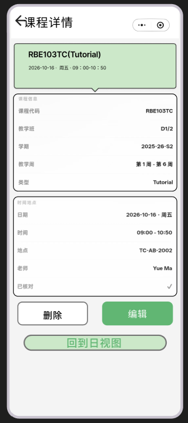

# 迁移到新企业账号（新云环境）操作手册

## 背景

- 小程序主体切换为新企业账号，新 AppID：`wxeb85ce18083355ce`（已写入 `project.config.json`）
- 当前生产云环境：`prod-d3ged1wr3c6f6ce74`（已写入 `utils/cloudConfig.js`、`cloudbaserc.json` 及各工具脚本）
- 历史环境已删除；迁移仅可使用已导出的离线备份，不能再从旧环境导出。

> ⚠️ **最重要的坑：openid 会变。** openid 是按「小程序 AppID + 用户」生成的，
> 换账号后同一微信用户在新 AppID 下的 openid 与旧环境完全不同。
> `users`、`friendships`、`schedules` 等集合里以 openid 关联的数据，直接导出导入后
> 在新环境下无法与登录用户对应。如果旧环境有真实用户数据，需要评估是否做
> openid 映射转换（腾讯云不提供跨主体 openid 转换接口，通常只能靠 unionid
> 或让用户重新登录后按手机号/昵称等字段认领）。如果旧环境只有测试/演示数据，
> 建议直接用 `seed` / `setupData` 云函数在新环境重建，跳过数据迁移。

## 第 0 步：前置准备

```bash
npm install -g @cloudbase/cli
tcb login          # 用新企业账号的微信扫码登录
tcb env list       # 确认能看到 prod-d3ged1wr3c6f6ce74
```

在微信开发者工具中重新打开项目，确认右上角 AppID 已变为 `wxeb85ce18083355ce`
（`project.config.json` 已改好；如提示项目不存在，用新账号重新导入项目目录）。

## 第 1 步：新环境建数据库集合- schedule_matches
- activities
- activity_publishers
- activity_subscriptions
- activity_registrations
- activity_comments
- activity_interactions
- activity_schedules
- user_blocks
- user_reports
- posts
- notifications
- schedule_import_tasks（即 ocr_tasks）

权限设置参照 `docs/database-schema.md` 第 16 节：用户数据类集合设为
「仅创建者可读写」，运营数据类（activities、activity_publishers）设为
「所有用户可读，仅管理端可写」。

## 第 2 步：导出旧环境数据（如有需要保留的数据）

控制台：云开发 → 数据库 → 选中集合 → 导出（JSON 格式，每行一条记录）。

CLI 方式（逐集合执行）：

```bash
# 历史环境已删除，不能执行导出；请使用已有 ./migration-backup/ 离线备份。
```

## 第 3 步：导入新环境

控制台：数据库 → 选中集合 → 导入（选择对应 JSON 文件，冲突模式选 upsert）。

CLI 方式：

```bash
tcb database import --envId prod-d3ged1wr3c6f6ce74 \
  --collection users --file ./migration-backup/users.json
```

> 再次提醒：导入前确认已处理 openid 问题（见文档开头警告）。
> 纯演示数据建议跳过 2、3 步，直接走第 5 步重建。

## 第 4 步：迁移云存储文件

小程序端会上传头像/图片到云存储（`utils/api.js` 中 `wx.cloud.uploadFile`），
数据库里存的是 `cloud://` 文件 ID（`utils/cloudImage.js` 解析）。文件 ID
绑定环境，换环境后旧的 `cloud://` 引用全部失效。

方案二选一：

1. **文件少/可重新上传**：让发布者头像、活动封面等在新环境重新上传
   （管理端/工具脚本重跑一次即可）。
2. **需要保留**：从旧环境控制台批量下载云存储文件，再上传到新环境相同路径，
   并更新数据库中的文件 ID 字段（`avatar`、`banner`、`images` 等，见
   `docs/database-schema.md` 各集合定义）。

## 第 5 步：部署全部云函数

`cloudfunctions/` 下共 12 个云函数需要部署：

```bash
cd cloudfunctions/<name> && npm install && cd ../..   # 每个函数先装依赖
tcb fn deploy <name> --envId prod-d3ged1wr3c6f6ce74
```

函数清单：`login`、`user`、`friends`、`friend`、`match`、`buddy`、`schedule`、
`activity`、`activityAdmin`、`AI_ocr`、`seed`、`setupData`

> 注意：`cloudfunctions/log-in/` 是旧残留目录（只有 node_modules，无入口文件），
> 不要部署它，建议确认无用后删除。

部署完成后：

```bash
# 重建基础数据（发布者、演示活动等，替代数据迁移时执行）
node tools/setupPaiSpace.js
node tools/addPublisherAndActivity.js
# 或通过 setupData / seed 云函数初始化
```

## 第 6 步：重建 HTTP 访问服务与静态托管

旧环境给 `activityAdmin` 配过 HTTP 触发器（云接入），管理后台托管在静态网站：

```bash
tcb service create --envId prod-d3ged1wr3c6f6ce74
tcb service list --envId prod-d3ged1wr3c6f6ce74
# 记录当前 prod 环境返回的 activityAdmin HTTP 地址

tcb hosting deploy admin/web --envId prod-d3ged1wr3c6f6ce74
tcb hosting list --envId prod-d3ged1wr3c6f6ce74
```

新域名生成后，检查管理后台前端配置里写死的旧域名并更新
（参照 `docs/deployment-workflow.md` 与 `docs/admin-guide.md`）。

## 第 7 步：验证清单

- [ ] 开发者工具编译无报错，控制台打印 `[Xipoo cloud env] prod-d3ged1wr3c6f6ce74`
- [ ] 登录正常：`login` 云函数 `ping` 返回新 openid
- [ ] 活动列表能读出数据（`activity` 云函数）
- [ ] 头像/图片上传后能正常显示（`cloud://` 引用指向新环境）
- [ ] 管理后台通过新托管域名可访问，`activityAdmin` 接口正常
- [ ] 好友/课表/匹配等核心链路各跑一遍（对应 `tests/` 下的测试可作参照）

## 第 8 步：收尾

- 历史环境已删除；确认当前 prod 环境的计费、云函数、云托管和静态托管均正常。
- 微信公众平台：确认服务器域名/业务域名白名单已切换为新环境域名
